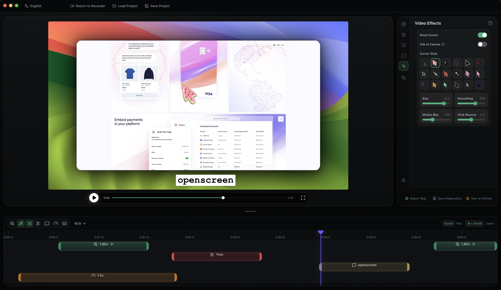

> [!Note]
> OpenScreen Linux is a Linux-focused community fork of OpenScreen. The original OpenScreen repository is archived and no longer maintained by its original author.

> [!NOTE]
> This fork targets Linux first. Non-Linux code from upstream may remain in the repository, but Linux is the maintained release path.

<p align="center">
  
</p>

# <p align="center">OpenScreen Linux</p>

<p align="center"><strong>OpenScreen Linux is a Linux-maintained fork of the free, open-source Screen Studio alternative.</strong></p>

If you don't want to pay $29/month for Screen Studio but want a version that does what most people seem to need - quick, polished product demos and walkthroughs you'd post on X, Reddit or Youtube. OpenScreen Linux does not offer every Screen Studio feature, but covers a lot of the core functionality.

Screen Studio is an awesome product and this is definitely not a 1:1 clone. If you just want something fully free and open source, this project should cover most of your needs.

**100% free** for both **personal** and **commercial** use. Use it, modify it, distribute it. Please respect the License. 

> [!NOTE]
>Software should be accessible. OpenScreen Linux has no paid tiers, premium features, upsells, or functionality locked behind a paywall.

<p align="center">
	
  
</p>

## Core Features
- Record a specific window, or your whole screen.
- Record microphone and system audio.
- Webcam overlay with picture-in-picture, drag-to-position, mirroring, and shape options.
- Auto or manual zooms with adjustable depth, duration, easing, and pixel-precise position; auto-zoom follows your cursor as you work.
- Linux cursor tracking for auto-zoom and focus behavior.
- Automatic captions for voiceovers, generated on-device with no upload (works offline).
- Wallpapers, solid colors, gradients, or your own background image.
- Motion blur.
- Crop, trim, and per-segment speed control on the timeline.
- Text, arrow, and image annotations, with text animation presets.
- Timeline snapping guides and an audio waveform to make trimming easier.
- Customizable keyboard shortcuts.
- Export to MP4 or GIF in multiple aspect ratios and resolutions.
- Languages supported: Arabic, English, Spanish, French, Italian, Japanese, Korean, Portuguese (Brazil), Russian, Turkish, Vietnamese, Simplified Chinese, and Traditional Chinese.


## Installation

Download Linux builds from this fork's [GitHub Releases](https://github.com/stefandotl/openscreen/releases) page.

### Linux

Pick the package that matches your distro:

**Debian / Ubuntu / Pop!_OS (`.deb`)**
```bash
sudo apt install ./OpenScreen-Linux-latest.deb
```

Build only the Debian package locally:
```bash
npm run build:native:linux-cursor && tsc && vite build && electron-builder --linux deb --config.npmRebuild=false
```

**Arch / Manjaro (`.pacman`)**
```bash
sudo pacman -U OpenScreen-Linux-latest.pacman
```

**Any distro (`.AppImage`)**
```bash
chmod +x OpenScreen-Linux-*.AppImage
./OpenScreen-Linux-*.AppImage
```

**NixOS / Nix (flake)**

Try without installing:
```bash
nix run github:stefandotl/openscreen
```

Install into your user profile:
```bash
nix profile install github:stefandotl/openscreen
```

For a NixOS system config (flake):
```nix
{
  inputs.openscreen.url = "github:stefandotl/openscreen";

  outputs = { nixpkgs, openscreen, ... }: {
    nixosConfigurations.<host> = nixpkgs.lib.nixosSystem {
      modules = [
        openscreen.nixosModules.default
        { programs.openscreen.enable = true; }
      ];
    };
  };
}
```

For Home Manager, use `openscreen.homeManagerModules.default` with the same `programs.openscreen.enable = true;`.

You may need to grant screen recording permissions depending on your desktop environment.

**Sandbox error:** If the AppImage fails to launch with a "sandbox" error, run it with `--no-sandbox`:
```bash
./OpenScreen-Linux-*.AppImage --no-sandbox
```

### Platform support

OpenScreen Linux focuses on Linux builds and Linux capture behavior. macOS and Windows code from upstream may still exist in the repository, but this fork's maintained path is Linux.

- **Recording**: Linux records through Electron/Chromium's browser capture pipeline.
- **Cursor tracking**: the Linux cursor helper records cursor position and click timing for auto-zoom and focus behavior. The original system cursor may already be baked into the recording, so the editor avoids drawing a second replacement cursor for Linux telemetry-only recordings.
- **Webcam**: Linux webcam capture works as a picture-in-picture overlay through the browser pipeline.
- **System audio**: Linux needs PipeWire (default on Ubuntu 22.04+, Fedora 34+). Older PulseAudio-only setups may not capture system audio; microphone capture should still work.

---

## License

This project is licensed under the [MIT License](./LICENSE). By using this software, you agree that the authors are not liable for any issues, damages, or claims arising from its use.
