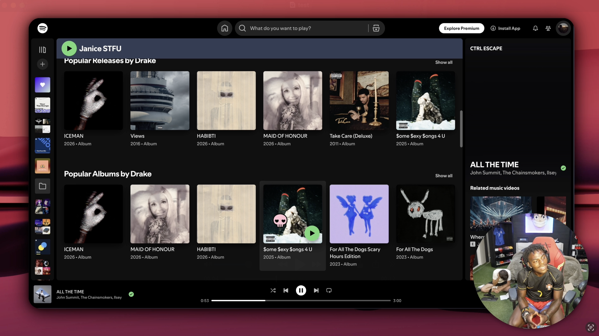
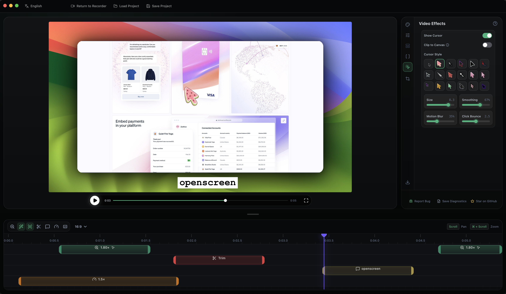

> [!NOTE]
> Videtio is derived from MIT-licensed OpenScreen code. The upstream copyright and
> permission notice are preserved in [LICENSE](./LICENSE); upstream authors are not
> presented as Videtio's current maintainers.

> [!NOTE]
> This fork targets Linux first. Non-Linux code from upstream may remain in the repository, but Linux is the maintained release path.

<p align="center">
  
</p>

# <p align="center">Videtio</p>

<p align="center"><strong>A free, open-source screen recorder and video editor, maintained with a Linux-first focus.</strong></p>

Videtio is built for quick, polished product demos and walkthroughs you can share on X, Reddit, or YouTube. It does not offer every Screen Studio feature, but covers much of the core workflow.

Screen Studio is an awesome product and this is definitely not a 1:1 clone. If you just want something fully free and open source, this project should cover most of your needs.

**100% free** for both **personal** and **commercial** use. Use it, modify it, distribute it. Please respect the License. 

> [!NOTE]
> Software should be accessible. Videtio has no paid tiers, premium features, upsells, or functionality locked behind a paywall.

<p align="center">
	
  
</p>

## Core Features
- Record a specific window, or your whole screen.
- Record microphone and system audio.
- Webcam overlay with picture-in-picture, drag-to-position, mirroring, and shape options.
- Auto or manual zooms with adjustable depth, duration, easing, and pixel-precise position; auto-zoom follows your cursor as you work.
- Linux cursor tracking for auto-zoom and focus behavior.
- Automatic captions for voiceovers, generated on-device with no upload (works offline).
- Wallpapers, solid colors, gradients, or your own background image.
- Motion blur.
- Crop, trim, and per-segment speed control on the timeline.
- Text, arrow, and image annotations, with text animation presets.
- Timeline snapping guides and an audio waveform to make trimming easier.
- Customizable keyboard shortcuts.
- Export to MP4 or GIF in multiple aspect ratios and resolutions.
- Languages supported: Arabic, English, Spanish, French, Italian, Japanese, Korean, Portuguese (Brazil), Russian, Turkish, Vietnamese, Simplified Chinese, and Traditional Chinese.


## Installation

Download Linux builds from the Releases page of this repository.

### Linux

Pick the package that matches your distro:

**Debian / Ubuntu / Pop!_OS (`.deb`)**
```bash
sudo apt install ./Videtio-latest.deb
```

Build only the Debian package locally:
```bash
npm run build:native:linux-cursor && tsc && vite build && electron-builder --linux deb --config.npmRebuild=false
```

**Arch / Manjaro (`.pacman`)**
```bash
sudo pacman -U Videtio-latest.pacman
```

**Any distro (`.AppImage`)**
```bash
chmod +x Videtio-*.AppImage
./Videtio-*.AppImage
```

**NixOS / Nix (flake)**

Try without installing:
```bash
nix run .
```

Install into your user profile:
```bash
nix profile install .
```

For a NixOS system config (flake):
```nix
{
  inputs.videtio.url = "github:YOUR_ORG/YOUR_REPOSITORY";

  outputs = { nixpkgs, videtio, ... }: {
    nixosConfigurations.<host> = nixpkgs.lib.nixosSystem {
      modules = [
        videtio.nixosModules.default
        { programs.videtio.enable = true; }
      ];
    };
  };
}
```

For Home Manager, use `videtio.homeManagerModules.default` with the same `programs.videtio.enable = true;`.

You may need to grant screen recording permissions depending on your desktop environment.

**Sandbox error:** If the AppImage fails to launch with a "sandbox" error, run it with `--no-sandbox`:
```bash
./Videtio-*.AppImage --no-sandbox
```

### Platform support

Videtio focuses on Linux builds and Linux capture behavior. macOS and Windows code may still exist in the repository, but Linux is the maintained release path.

- **Recording**: Linux records through Electron/Chromium's browser capture pipeline.
- **Cursor tracking**: the Linux cursor helper records cursor position and click timing for auto-zoom and focus behavior. The original system cursor may already be baked into the recording, so the editor avoids drawing a second replacement cursor for Linux telemetry-only recordings.
- **Webcam**: Linux webcam capture works as a picture-in-picture overlay through the browser pipeline.
- **System audio**: Linux needs PipeWire (default on Ubuntu 22.04+, Fedora 34+). Older PulseAudio-only setups may not capture system audio; microphone capture should still work.

---

## License

This project is licensed under the [MIT License](./LICENSE). The original copyright
notice remains in that file as required by the license; it is an attribution notice,
not a statement that the named copyright holder currently maintains Videtio.
